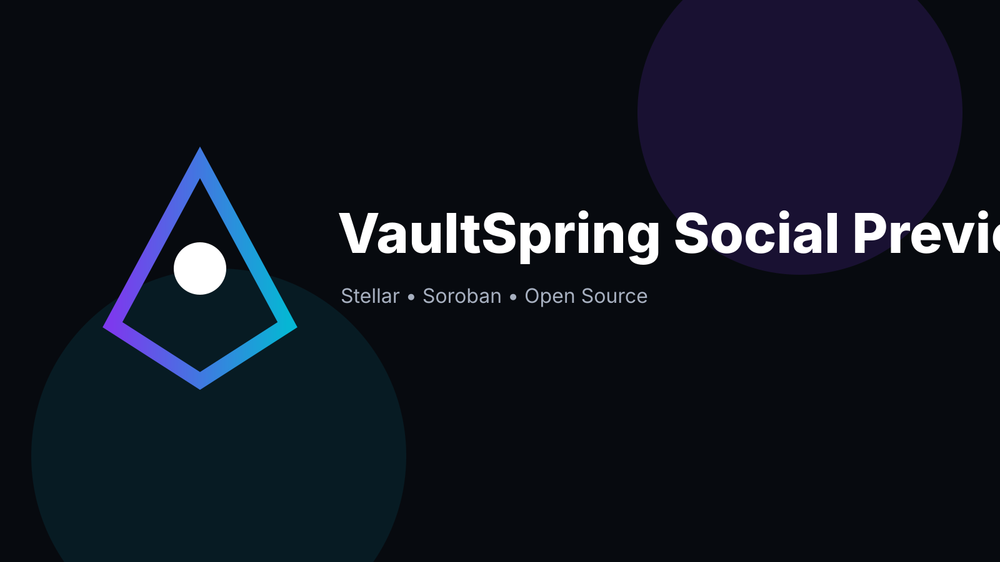

# VaultSpring — vaultspring-contracts

> Goal-based savings vaults with auditable milestone releases.

## Role

This repository is one part of the **VaultSpring** three-repository system. See the organization README for the dependency map.

## Maintainer

`@lekanay2005-coder`

## Status

**v0.1.0 development baseline — not audited and not production-ready.**

## Stellar alignment

The project uses Stellar/Soroban where on-chain state is the source of truth or where deterministic settlement is valuable. Off-chain services are kept out of consensus-critical logic.

## License

Apache-2.0
